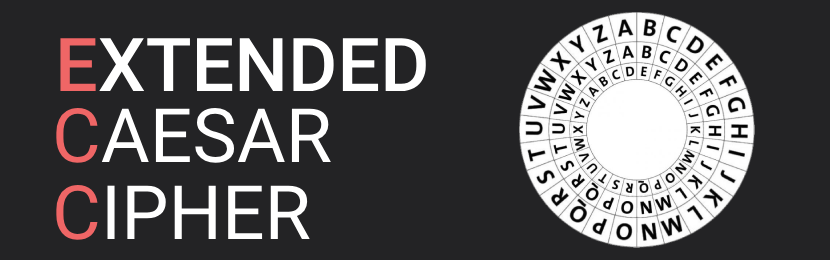

# Extended Caesar Cipher 

The Extended Caesar Cipher is a modified version of the classic Caesar cipher. Unlike the traditional cipher, which uses a single shift for all letters, this extended version allows you to specify different shifts for different parts of the text. This adds an extra layer of complexity and security, making it more versatile than the original Caesar cipher.

## Contributing

Contributions are always welcome!

See `contributing.md` for ways to get started.

Please adhere to this project's `code of conduct`.

## License

[MIT](https://choosealicense.com/licenses/mit/)

## Appendix

Future plans include adding Docker for simplified local development and testing
